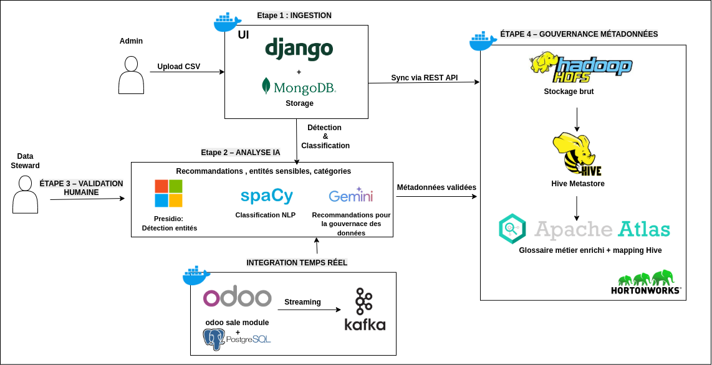

# Plateforme de Détection Automatique de Données Sensibles et Gouvernance Intelligente des Métadonnées

## 📋 Table des Matières
- [🎯 Vue d'ensemble](#-vue-densemble)
- [🏗️ Architecture du Système](#️-architecture-du-système)
- [🧩 Prérequis](#-prérequis)
- [⚙️ Installation et Déploiement](#️-installation-et-déploiement)
- [🔧 Configuration des Services Externes](#-configuration-des-services-externes)
- [📥 Chargement des Données dans HDP Sandbox](#-chargement-des-données-dans-hdp-sandbox)
- [🔄 Migration des Métadonnées vers Apache Atlas](#-migration-des-métadonnées-vers-apache-atlas)
- [🧠 Technologies Utilisées](#-technologies-utilisées)

---

## 🎯 Vue d'ensemble

Cette plateforme intégrée offre une solution complète pour la **détection automatique de données sensibles** conforme au **RGPD** et la **gouvernance intelligente des métadonnées**.  
Le système combine plusieurs composants d’**intelligence artificielle** (*Microsoft Presidio*, *spaCy*, *Google Gemini*) avec des outils de **gouvernance d’entreprise** (*Apache Atlas*, *Apache Hive*) afin d’assurer une gestion optimale des données personnelles.

### Fonctionnalités principales

✅ Détection automatique d’entités **PII/SPI** avec reconnaissance d’entités marocaines spécifiques (*CIN, RIB, numéros de téléphone*)  
✅ Double mode d’ingestion : **traitement par lots (CSV)** et **streaming temps réel (Apache Kafka)**  
✅ **Recommandations intelligentes** générées par **IA (Google Gemini API)**  
✅ **Workflows de validation** pour les *data stewards* avec interface intuitive  
✅ **Synchronisation automatique** avec **Apache Atlas** pour création de glossaires métiers  
✅ **Analyse de qualité des données** avec suggestions d’amélioration  
✅ **Intégration avec Odoo ERP** pour surveillance continue de la conformité RGPD

## 🏗️ Architecture du Système


## ⚙️ Workflow Général du Système

Le système implémente un workflow en **quatre étapes principales** :

### 🧩 Étape 1 : Ingestion des Données

- **Upload CSV (Administrateur)** : Téléchargement manuel de fichiers CSV via l'interface Django, stockage dans **MongoDB GridFS**.  
- **Streaming Temps Réel (Kafka)** : Flux continu de données clients depuis **Odoo ERP** via **Apache Kafka**.

---

### 🤖 Étape 2 : Analyse IA

- **Microsoft Presidio** : Détection d'entités PII (*PERSON, EMAIL, PHONE, ID_MAROC, IBAN_CODE*, etc.)  
- **spaCy NLP** : Analyse sémantique et classification contextuelle  
- **Google Gemini API** : Génération de recommandations intelligentes (*COMPLIANCE, SECURITY, QUALITY, GOVERNANCE*)

---

### 👩‍💼 Étape 3 : Validation Humaine

- Interface de révision des métadonnées enrichies par IA  
- Validation, rejet ou modification des recommandations par les **data stewards**  
- Gestion des annotations et contrôles qualité

---

### 🧭 Étape 4 : Gouvernance des Métadonnées

- **Apache Hive** : Mapping des colonnes validées vers les structures de tables existantes  
- **Apache Atlas** : Création automatique de glossaires métiers, termes, classifications RGPD  
- **Hortonworks Data Platform (HDP)** : Intégration avec l’infrastructure de gouvernance d’entreprise

---

## 🔧 Prérequis

### Logiciels requis
- Docker (version 20.10+)
- Docker Compose (version 1.29+)
- Git
- Python 3.8+

### Services externes
- **HDP Sandbox** : Environnement Hortonworks Data Platform avec Apache Atlas et Hive  
- **Google Gemini API** : Clé API pour génération de recommandations intelligentes  
- **MongoDB** : Base de données documentaire pour stockage des métadonnées  
- **Apache Kafka** : Plateforme de streaming pour ingestion temps réel

---

## 🚀 Installation et Déploiement

### 1️⃣ Cloner le dépôt principal
```bash
git clone https://github.com/khadijatarhri/Automatic-detection-of-sensitive-data-recommendation-engine-for-metadata-govnance.git
cd Automatic-detection-of-sensitive-data-recommendation-engine-for-metadata-govnance.git
```
### Créer l'utilisateur administrateur  
Dans un nouveau terminal, exécutez :

```bash
sudo docker exec -it sensitive-data-detection-web-1 python create_admin.py
```
### Accéder à l'application
Ouvrez votre navigateur et allez à :
http://127.0.0.1:8000/login

### Se connecter
Utilisez les identifiants par défaut :

Email : admin@example.com

Mot de passe : admin123

### 2️⃣ Configuration des variables d'environnement
Créez un fichier .env à la racine du projet :
```bash
# Django Configuration
DJANGO_SECRET_KEY=votre_clé_secrète_django
DEBUG=True
ALLOWED_HOSTS=localhost,127.0.0.1

# MongoDB Configuration
MONGO_HOST=mongodb
MONGO_PORT=27017
MONGO_DB_NAME=csv_anonymizer_db
MONGO_METADATA_DB=metadata_validation_db

# Google Gemini API
GEMINI_API_KEY=votre_clé_api_gemini

# Apache Atlas Configuration
ATLAS_HOST=sandbox-hdp.hortonworks.com
ATLAS_PORT=21000
ATLAS_USERNAME=admin
ATLAS_PASSWORD=admin

# Kafka Configuration
KAFKA_BOOTSTRAP_SERVERS=kafka:9092
KAFKA_TOPIC=odoo-customer-data
```

### 3️⃣ Construire et lancer les conteneurs
```bash
docker-compose up --build
```
Les services suivants seront démarrés :
 - Django Web App : http://localhost:8000/login
 - MongoDB : localhost:27017
 - Kafka Consumer : Service en arrière-plan pour traitement des flux Odoo


### 4️⃣ Créer un super utilisateur Django
```bash
docker exec -it django-web python manage.py createsuperuser
```


### 
```bash
```


### Les services suivants seront démarrés :

 - Django Web App : http://localhost:8000/login
 - MongoDB : localhost:27017
 - Kafka Consumer : Service en arrière-plan pour traitement des flux Odoo

### 4️⃣ Créer un super utilisateur Django
```bash
docker exec -it django-web python manage.py createsuperuser
```


## ⚙️ Configuration des Services Externes : Apache Kafka et Odoo ERP

Le système nécessite deux services externes hébergés dans des dépôts séparés :


### 1. Kafka Orchestrator
```bash
git clone https://github.com/khadijatarhri/KafkaOrchestrator.git
cd KafkaOrchestrator
docker-compose up --build
```

Ce service démarre :
 - Apache Kafka (broker et ZooKeeper)
 - Kafka UI : http://localhost:8080

### 2. Odoo Customer Module
```bash
git clone https://github.com/khadijatarhri/OdooCustomer.git
cd OdooCustomer
docker-compose up --build
```
Ce service démarre :
 - Odoo ERP : http://localhost:8069
 - PostgreSQL backend pour Odoo
 - Producteur Kafka intégré pour publier les événements clients

Configuration de connexion Odoo :
 - Login : admin
 - Mot de passe : admin

# 🚀 Chargement des Données dans HDP Sandbox

## 📋 Prérequis
- Conteneur `sandbox-hdp` en fonctionnement  
- Fichier CSV local à charger (ex: `entites_marocaines_diversifiees.csv`)

---

## ⚙️ Étapes

### Étape 1 : Copier le fichier CSV dans le conteneur
```bash
docker cp /chemin/vers/votre/fichier.csv sandbox-hdp:/tmp/
docker exec -it sandbox-hdp ls -l /tmp/fichier.csv
```
### Étape 2 : Se connecter au conteneur HDP
```bash
docker exec -it sandbox-hdp /bin/bash
```

### Étape 3 : Créer un répertoire HDFS et charger le fichier
```bash
sudo -u hdfs hdfs dfs -mkdir -p /user/khadija/entites_marocaines_diversifiees
sudo -u hdfs hdfs dfs -put -f /tmp/fichier.csv /user/khadija/entites_marocaines_diversifiees/
hdfs dfs -ls -h /user/khadija/entites_marocaines_diversifiees
```

### Étape 4 : Corriger les permissions pour Hive

```bash
sudo -u hdfs hdfs dfs -chown -R hive:hive /user/khadija/entites_marocaines_diversifiees
```
### Étape 5 : Créer la table Hive
```bash
beeline -u "jdbc:hive2://localhost:10000" -n hive

DROP TABLE IF EXISTS entites_marocaines;

CREATE EXTERNAL TABLE entites_marocaines (
    text_id INT,
    text STRING,
    person STRING,
    id_maroc STRING,
    phone_number STRING,
    email_address STRING,
    iban_code STRING,
    date_time STRING,
    location STRING
)
ROW FORMAT DELIMITED
FIELDS TERMINATED BY ','
STORED AS TEXTFILE
LOCATION '/user/khadija/entites_marocaines_diversifiees'
TBLPROPERTIES ("skip.header.line.count"="1");
```

### Étape 6 : Vérifier la table

```bash
SHOW TABLES;
SELECT * FROM entites_marocaines LIMIT 5;
```

# 🔄 Migration des Métadonnées vers Apache Atlas

Une fois les métadonnées validées dans l'interface Django, lancez la synchronisation :

```bash
docker exec -it django-web python atlas_entity_migration.py
```
Cette commande :
 - Crée automatiquement les glossaires RGPD
 - Génère des termes de glossaire avec descriptions conformes
 - Applique les classifications de sensibilité
 - Mappe les termes aux colonnes Hive correspondantes
 - Établit la traçabilité complète pour les audits de conformité


# 🛠️ Technologies Utilisées

## 🧩 Backend
- **Django 4.2** – Framework web full-stack **Python**
- **MongoDB** – Base de données **NoSQL documentaire**
- **GridFS** – Stockage de fichiers volumineux

---

## 🤖 Intelligence Artificielle
- **Microsoft Presidio** – Détection et anonymisation des **PII (informations personnelles)**
- **spaCy** – Traitement du **langage naturel (NLP)**
- **Google Gemini API** – Génération et recommandations basées sur l’**IA**

---

## 🏢 Gouvernance d’Entreprise
- **Apache Atlas** – Gestion et classification des **métadonnées**
- **Apache Hive** – Entrepôt de données analytique
- **Apache Kafka** – Système de **streaming distribué**

---

## 🎨 Frontend
- **HTML5 / CSS3 / JavaScript**
- **Tailwind CSS** – Framework **utility-first**
- **Django Templates** – Moteur de rendu côté serveur

---

## ⚙️ DevOps & Infrastructure
- **Docker & Docker Compose** – Conteneurisation et orchestration
- **Git & GitHub** – Gestion de versions et collaboration
- **Playwright** – Tests **end-to-end** automatisés

---

## 📄 Licence

Ce projet a été développé dans le cadre d’un stage au laboratoire ADMIR - ENSIAS.

## 📧 Contact

Pour toute question ou suggestion, n’hésitez pas à ouvrir une issue sur GitHub.

Développé avec ❤️ au Laboratoire ADMIR - ENSIAS

